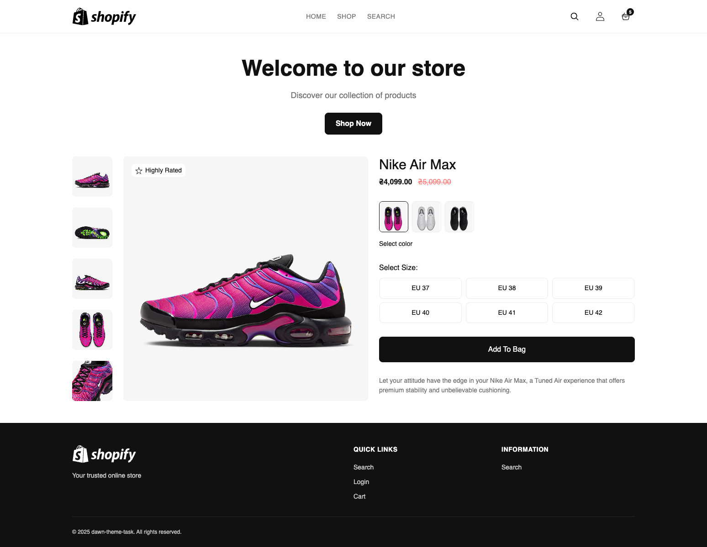

### Результат виконаного ДЗ

#### [ДЗ] Shopify Liquid — Мінімальна тема з нуля (без schema)

✅ **HTML / Liquid**

- [x] Створив базовий `layout/theme.liquid` з обов’язковими якорями
      `{{ content_for_header }}` і `{{ content_for_layout }}`

- [x] Підключив секції:

  - `header.liquid` — шапка сайту з логотипом, навігацією та посиланням на кошик

  - `footer.liquid` — підвал сайту з навігацією, логіном і пошуком

- [x] Виніс повторювані елементи у **snippets**:

  - `logo.liquid` — логотип магазину

  - `nav-main.liquid` — головне меню

  - та інші

- [x] Підключив навчальну секцію `banner-product.liquid` (без schema)

- [x] Всі тексти виніс у переклади через t з `locales/en.default.json`.

- [x] Використав системні посилання через `routes` (`routes.cart_url`,
      `routes.account_login_url`, `routes.search_url`)

- [x] Дотримався семантики HTML5: `<header>`, `<main>`, `<footer>` ARIA-лейбли
      для навігацій

- [x] Контролював зайві пробіли у шаблонах через ``

✅ **Локалізація (locales)**

- [x] Створив файл `locales/en.default.json`

```json
{
  "home": {
    "welcome": "Welcome to our store",
    "description": "Discover our collection of products",
    "shop_now": "Shop Now"
  },
  "header": {
    "home": "Home",
    "shop": "Shop",
    "search": "Search",
    "cart": "Cart",
    "account": "Account"
  },
  "footer": {
    "description": "Your trusted online store",
    "links_heading": "Quick Links",
    "info_heading": "Information",
    "search": "Search",
    "login": "Login",
    "cart": "Cart",
    "copyright": "All rights reserved."
  },
  "a11y": {
    "main_nav": "Main navigation",
    "footer_nav": "Footer navigation",
    "footer_info": "Information",
    "search": "Search",
    "account": "Account",
    "open_cart": "Open cart",
    "select_color": "Select color"
  },
  "products": {
    "badge": {
      "highly_rated": "Highly Rated"
    },
    "product": {
      "banner": {
        "not_found": "Product not found",
        "select_color": "Select color",
        "select_color_prompt": "Choose a color",
        "select_size": "Select Size:",
        "select_size_label": "Select size",
        "add_to_bag": "Add To Bag",
        "not_available": "Not available",
        "available_with_count": "Available: {{ count }}"
      }
    }
  }
}
```

✅ **Технології та підходи**

- [x] **Liquid** — основна логіка теми

- [x]**Shopify OS 2.0 structure** — використання layout → sections → snippets →
  locales

- [x] **i18n** — переклади через `t`

- [x] **HTML** — семантична верстка з підтримкою доступності

- [x] **DRY-принцип** — повторні блоки винесено у snippets

- [x] **Оптимізація** — контроль пробілів `` та lazy-завантаження
      зображень

🛠️ **Використані інструменти**

- [x] Shopify Liquid

- [x] Shopify Theme architecture

- [x] JSON локалі

- [x] HTML5 / CSS3 / JavaScript

🔗 **Посилання:**

- [x] Pull Request:
      https://github.com/ViktorSvertoka/shopify-theme/tree/mini-theme

- [x] GitHub гілка: mini-theme

- [x] Shopify Admin:
      https://dawn-theme-task.myshopify.com/?preview_theme_id=180998308142

- [x] Пароль від теми: iawhoh



> [!NOTE]
>
> pull local - shopify theme pull -e development
>
> run server - shopify theme dev -e development
>
> update page - shopify theme push -e development
