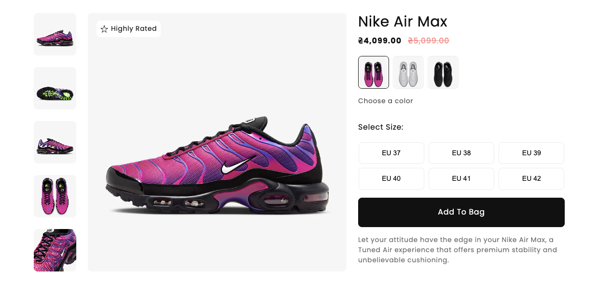

### Результат виконаного ДЗ

✅ **HTML / Liquid**

- [x] Підключив власні стилі (banner-product.css) та скрипти (banner-product.js)

- [x] Реалізував перевірку: якщо товар не знайдений – показується повідомлення
      про помилку

- [x] Додав блок галереї з головним зображенням та прев’ю

- [x] Вивів заголовок товару, бейдж “Highly Rated” (якщо є тег)

- [x] Відобразив ціну (акційна / звичайна)

- [x] Зробив блок з кольорами товару (кнопки кольорів)

- [x] Додав блок вибору розмірів (кнопки розмірів)

- [x] Кнопка додати в кошик для додавання першого варіанта в кошик

✅ **JavaScript логіка**

- [x] Реалізував рендер галереї при виборі кольору (підтягування відповідних
      картинок)

- [x] Налаштував зміну головної картинки при кліку на прев’ю

- [x] Зробив оновлення ціни при перемиканні кольору (акційна / стара ціна)

- [x] Додав відображення кількості на складі (доступний / недоступний з
      кількістю)

- [x] Реалізував підсвічування активної кнопки кольору

- [x] Реалізував підсвічування активної кнопки розміру

✅ **UI / UX ефекти**

- [x] Додав активний стан для вибраного кольору та розміру

- [x] Забезпечив автоматичний показ першого варіанту (перший колір + його фото
      та ціна відображаються одразу)

- [x] Зробив fallback на плейсхолдер-зображення, якщо у товару немає фото

🛠 **Технології та підходи**

- [x] Liquid (динамічне відображення даних товару в темі)

- [x] HTML + CSS (структура та стилізація банера товару)

- [x] JavaScript (робота з DOM, оновлення ціни, галереї, стану товару)

- [x] Shopify Product API (отримання даних про варіанти, ціни, сток)

- [x] Робота з варіантами товарів (кольори, розміри, фото, кількість)

- [x] UX-підхід: інтерактивна галерея, підсвічування активних опцій, fallback
      для зображень

> [!NOTE]
>
> pull local - shopify theme pull -e development
>
> run server - shopify theme dev -e development
>
> update page - shopify theme push -e development
