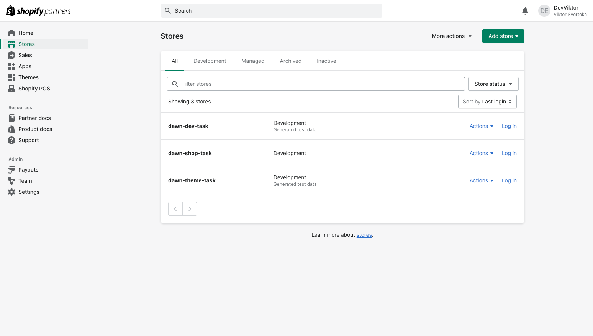
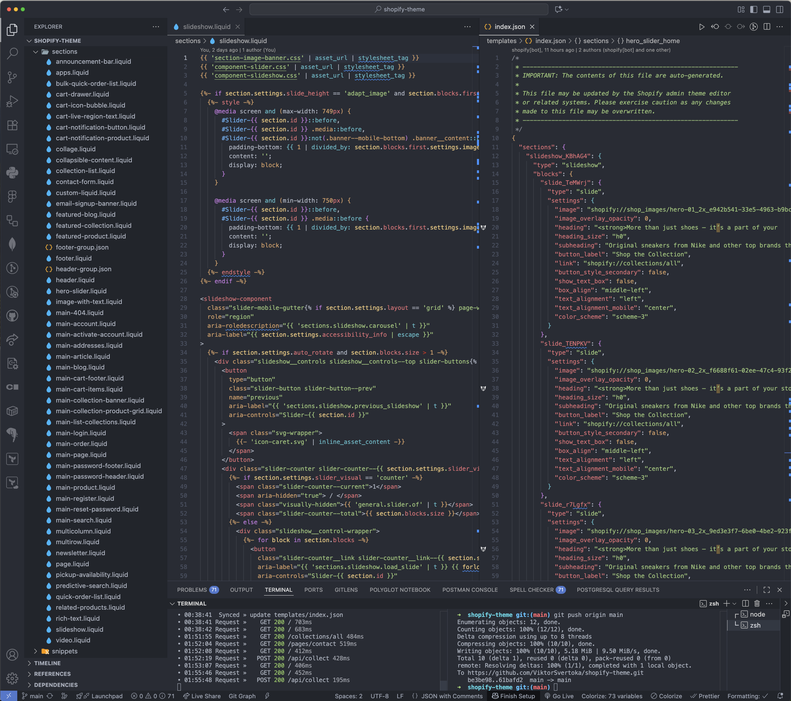
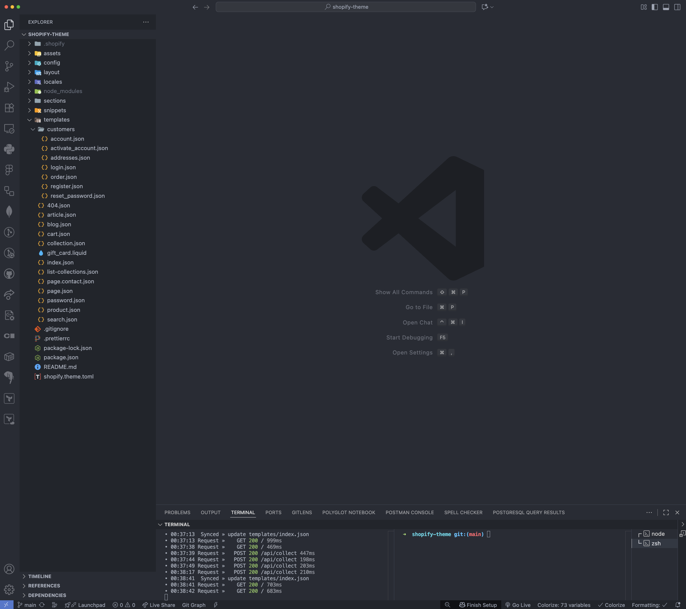
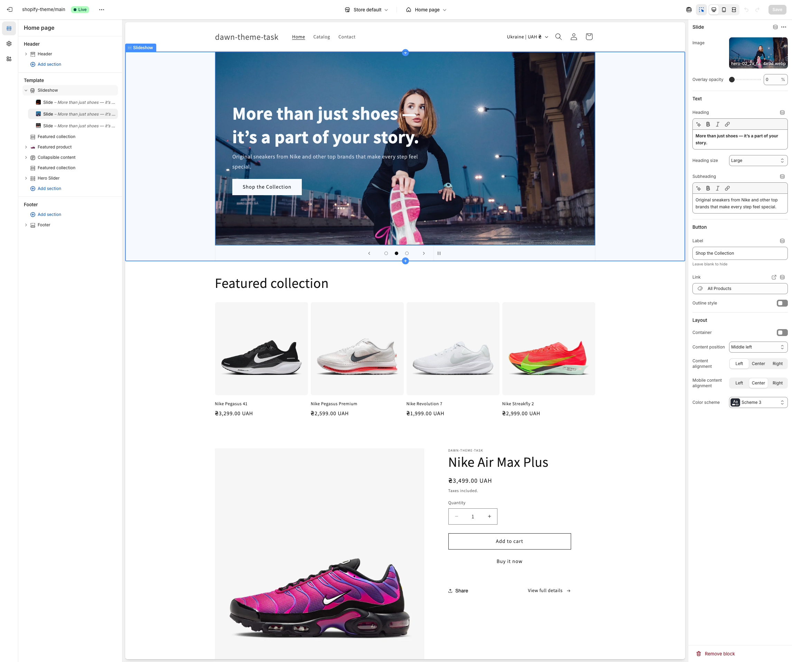
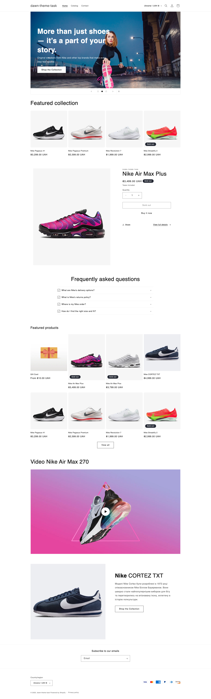

### Результат виконаного ДЗ

#### Завдання 1

- Скріншот з Shopify Partner Account (створений Development Store).

#### Завдання 2

- Скріншот з локальним кодом Dawn (папки `sections`, `templates`).

#### Завдання 3

- Скріншот з Theme Editor, де показаний Hero Banner (Slideshow).

> [!NOTE]
>
> pull local - shopify theme pull -e development
>
> run server - shopify theme dev -e development
>
> update page - shopify theme push -e development
